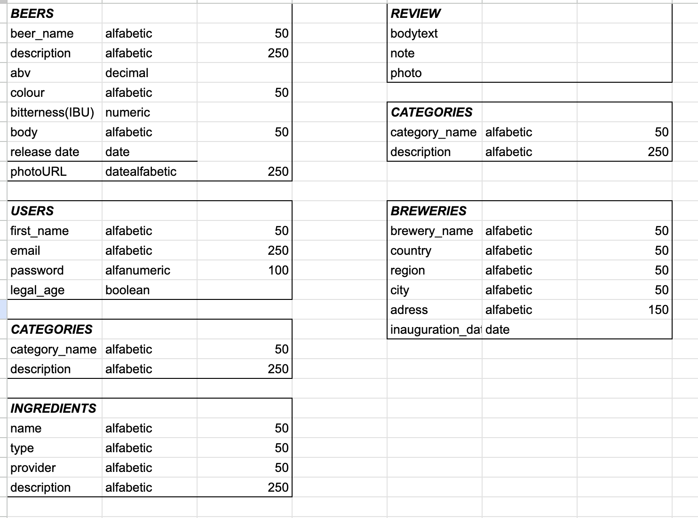
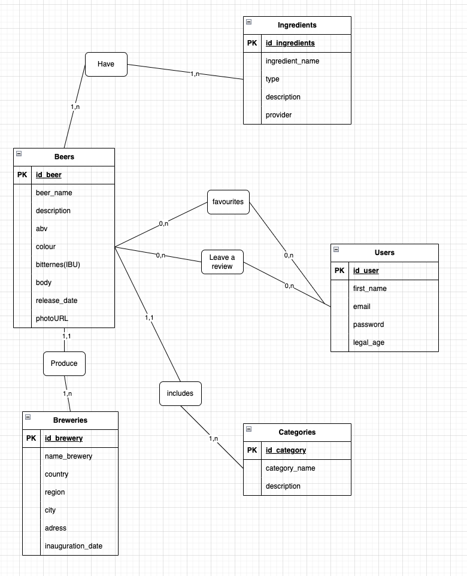
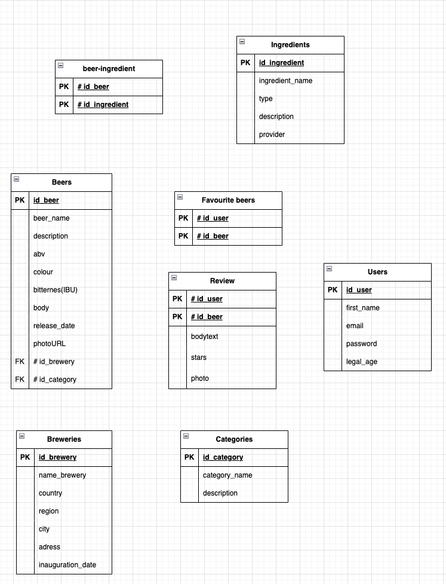
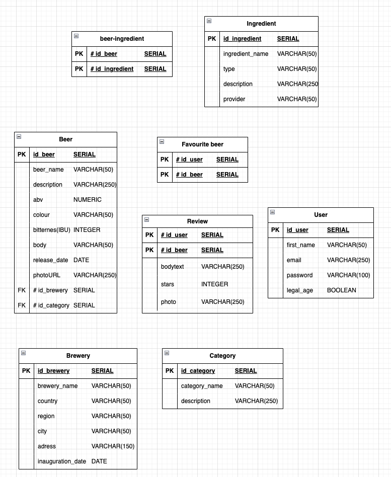

# Zytologue_LDF
Base de Données pour Amateurs de la Bière

## 1) Set up the environment for the project

First, make sure to download docker desktop from their site [Docker](https://www.docker.com/).
Then you need to run the docker-compose script to create the postgres database server container.

The comand is: `docker-compose up`

## 2) Connection to DBeaver

Make sure to download the cross-platform database tool [DBeaver](https://dbeaver.io/)

Create a connection to your DB server.

# About the tables

We used the Merise method to create the tables. This consist on differents steps, in which we get as a result the following diagrams

## Data Dictionary

## MCD

## MLD

## MPD

## 3) Create the dabase tables
The docker-compose file will create for you the database, so it's time for you to create the tables.
Use the *creation_tables.sql* script to do it.

The command you can use is: `docker exec -i postgres_container psql -U postgres_user -d zytologueDB < /Users/user/simplon/brief_docker/Zytologue_LDF/sql-scripts/creation_tables.sql`

NOTE: Make sure to run the command from the root repository of the project

## 4) Populate your tables
You can fill the tables with some mock data provided in the *mock_data.sql* file.

The command you can use is: `docker exec -i postgres_container psql -U postgres_user -d zytologueDB < /Users/user/simplon/brief_docker/Zytologue_LDF/sql-scripts/mock_data.sql`

## 5) Run the querys

On the *querys.sql* file you're going to find all the querys to run and test.

The command you can use is: `docker exec -i postgres_container psql -U postgres_user -d zytologueDB < /Users/user/simplon/brief_docker/Zytologue_LDF/sql-scripts/querys.sql`

## 6) Retour Projet Maëva 

The instructions to setup the environment are clear and easy to follow through.
The scripts to create tables and insert data run well. One little remark that can be done is that to run the scripts, an extra step needs to be done compared to what is written on the readme.
Another remark is that there is no script or whatsoever to inizialise the tables.

For the querys, they almost all work with an exception.

Very good work and project :)

[Link to her project repo](https://github.com/2024-devops-alt-dist/zythologue-MC)